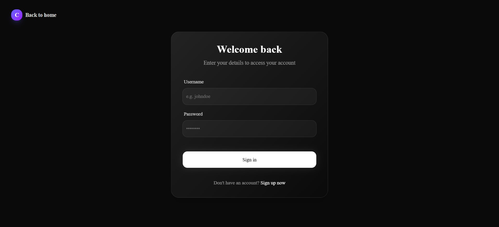
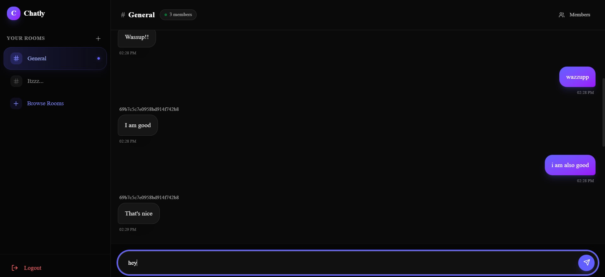
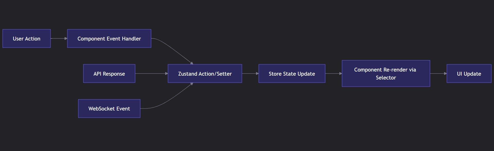

# 🚀 Chatly Frontend

<p align="center">
  
  
  
  
  
</p>

<p align="center">
  <strong>A modern, real-time chat application built with Next.js, TypeScript, and shadcn/ui</strong>
</p>

<p align="center">
  <a href="#-features">✨ Features</a> •
  <a href="#-tech-stack">🛠 Tech Stack</a> •
  <a href="#-architecture--data-flow">🏗 Architecture</a> •
  <a href="#-getting-started">🚀 Getting Started</a> •
  <a href="#-project-structure">📁 Project Structure</a> •
  <a href="#-environment-variables">⚙️ Environment</a> •
  <a href="#-available-scripts">📜 Scripts</a> •
  <a href="#-contributing">🤝 Contributing</a>
</p>

---

# 📋 Table of Contents

<details>
<summary><strong>Click to expand/collapse sections</strong></summary>

- 🎯 Product Overview  
- ✨ Features  
- 🖼 Screenshots  
- 🛠 Tech Stack  
- 🏗 Architecture & Data Flow  
- 🚀 Getting Started  
- 📁 Project Structure  
- ⚙️ Environment Variables  
- 📜 Available Scripts  
- 🧪 Testing  
- 🚢 Deployment  
- 🤝 Contributing  
- 📄 License  

</details>

---

# 🎯 Product Overview

Chatly is a **sleek, modern web-based messaging application** designed for seamless real-time communication.

Built as a **Single Page Application (SPA)** using **Next.js 16 App Router**.

### 💡 Core Value Proposition

- 🔐 Secure Authentication  
- 💬 Real-Time Messaging (WebSocket-ready)  
- 📱 Fully Responsive UI  
- 🎨 Beautiful UI (shadcn/ui + Tailwind)  
- ⚡ High Performance (Server Components + Client Hydration)

---

# ✨ Features

## 👤 User Features

| Feature | Description | Status |
|------|-------------|------|
| 🔐 User Authentication | Secure login & registration | ✅ |
| 💬 One-on-One Chat | Private conversations | ✅ |
| 📋 Chat List Sidebar | Organized conversation list | ✅ |
| ✉️ Message Input | Rich text input | ✅ |
| 🔄 Real-Time Updates | Instant message delivery | ✅ |
| 🔔 Toast Notifications | Feedback via Sonner | ✅ |
| 🎭 Animated UI | Smooth transitions (Framer Motion) | ✅ |
| 🌙 Dark/Light Mode | Theme switching | 🔄 |
| 📎 File Attachments | Images & documents | 📅 Planned |
| 👥 Group Chats | Multi-user rooms | ✅ |

---

## 👨‍💻 Developer Features

- shadcn/ui component library  
- Tailwind CSS v4 design system  
- Zustand state management  
- Axios with interceptors  
- ESLint + TypeScript  
- Optimized Next.js builds  
- WCAG-compliant components  

---

# 🖼 Screenshots

## 🏠 Login Page

<p align="center">
  
  <br>
  <em>Home Page</em>
</p>

<p align="center">
  
  <br>
  <em>Secure authentication interface</em>
</p>

---

## 💬 Chat Dashboard

<p align="center">
  
  <br>
  <em>Main chat interface with sidebar navigation</em>
</p>

---

# 🛠 Tech Stack

## Core

- **Next.js 16.1.6**
- **React 19.2.3**
- **TypeScript 5.x**
- **Tailwind CSS 4.x**
- **shadcn/ui**

## Key Dependencies

- axios `^1.13.6`
- zustand `^5.0.11`
- framer-motion `^12.36.0`
- lucide-react `^0.577.0`
- sonner `^2.0.7`

---

# 🏗 Architecture & Data Flow

  

Architecture highlights:


- **Next.js App Router + Server Components**
- **Zustand** for lightweight global state
- **Axios interceptors** for authentication and error handling
- **Unidirectional data flow**
- **WebSocket-ready architecture**

---

# 🚀 Getting Started

Clone the repository:

```bash
git clone https://github.com/parmeet20/chatly-frontend.git
cd chatly-frontend
```

Install dependencies:

```bash
# Using bun (recommended)
bun install

# or npm
npm install
```

Setup environment variables:

```bash
cp .env.example .env.local
```

Edit `.env.local`.

Run development server:

```bash
bun dev
# or
npm run dev
```

Open:

```
http://localhost:3000
```

---

# 📁 Project Structure

```
chatly-frontend
│
├── app
│   ├── api
│   ├── auth
│   ├── chats
│   ├── layout.tsx
│   ├── page.tsx
│   └── globals.css
│
├── src
│   ├── components
│   ├── hooks
│   ├── lib
│   ├── store
│   └── types
│
├── public
│   └── screenshots
│
├── .env.example
└── README.md
```

---

# ⚙️ Environment Variables

Create `.env.local`.

```env
NEXT_PUBLIC_API_BASE_URL=http://localhost:5000/api
NEXT_PUBLIC_WS_URL=ws://localhost:5000/ws
NEXT_PUBLIC_AUTH_PROVIDER=credentials
NEXT_PUBLIC_ENABLE_FILE_UPLOADS=false
NEXT_PUBLIC_ENABLE_GROUP_CHATS=false
NEXT_PUBLIC_APP_URL=http://localhost:3000
```

---

# 📜 Available Scripts

```bash
bun dev         # Start development server
bun build       # Production build
bun start       # Run production build
bun lint        # Run ESLint
bun type-check  # TypeScript checking
bun format      # Format code
```

---

# 🧪 Testing

Testing support can be added using:

- **Vitest**
- **Jest**
- **Playwright**

---

# 🚢 Deployment

Recommended platform:

**Vercel**

Steps:

1. Connect GitHub repository
2. Add environment variables
3. Deploy automatically

---

# 🤝 Contributing

1. Fork the repository
2. Create a branch

```
feat/feature-name
fix/bug-name
docs/update
```

3. Follow **conventional commits**
4. Run checks

```bash
bun lint && bun type-check
```

5. Open a Pull Request

---

<p align="center">
Made with ❤️ by <strong>Parmeet Singh</strong>
</p>

<p align="center">
⭐ Star the repository if you like it!
</p>
